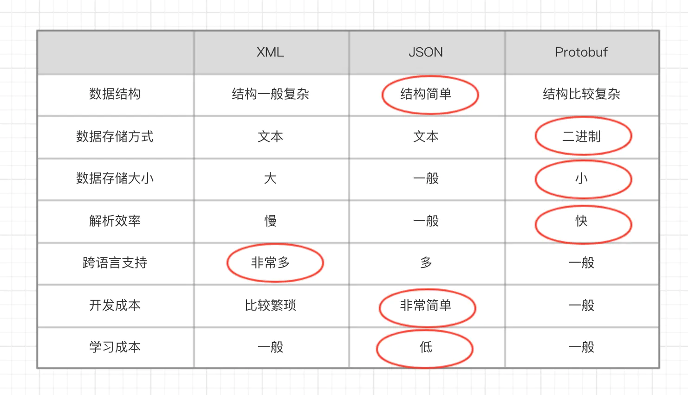

# Protobuf 使用指南

## 一、简介

最近在手撸 IM 系统，关于数据传输格式的选择，犹豫了下，对比了 JSON 和 XML，最后选择了 Protobuf 作为数据传输格式。

毕竟 Google 出品，必属精品😂，[[官网地址\]](https://links.jianshu.com/go?to=https%3A%2F%2Fdevelopers.google.com%2Fprotocol-buffers%2Fdocs%2Fproto3)。
 好了，舔狗环节结束，关于技术选择，都是需要根据实际的应用场景的，否则都是耍流氓，下文会进行简单的对比，先来看看官网的介绍：

> 他是一种与语言无关、与平台无关，是一种可扩展的用于序列化和结构化数据的方法，常用于用于通信协议，数据存储等。
>  他是一种灵活，高效，自动化的机制，用于序列化结构化数据，对比于 XML，他更小（310倍），更快（20100倍），更简单。

当然，最简单粗暴的理解方式，就是结合 JSON 和 XML 来理解，你可以暂时将他们仨理解成同一种类型的事物，但是呢，Protobuf 对比于他们两个，拥有着体量更小，解析速度更快的优势，所以，在 IM 这种通信应用中，非常适合将 Protobuf 作为数据传输格式。

## 二、关于 proto3

Protobuf 有两个大版本，proto2 和 proto3，同比 python 的 2.x 和 3.x 版本，如果是新接触的话，同样建议直接入手 proto3 版本。所以下文的描述都是基于 proto3 的。

proto3 相对 proto2 而言，简言之就是支持更多的语言（Ruby、C#等）、删除了一些复杂的语法和特性、引入了更多的约定等。

> 为什么要关注语言，因为它不像 JSON 一样开箱即用，它依赖工具包来进行编译成 java 文件或 go 文件等。

正如硬币的两面性一样，凡事皆有双面性，Protobuf 数据的体量更小，所以自然失去了人类的直接可读性， JSON 数据结构是可以很直观地阅读的，但是 Protobuf 我们需要借助工具来进行更友好地使用，所以，我们需要自定义一个 schema 来定义数据结构的描述，即下面的 message。

- Message

举个很简单的栗子，摘自官网：

```proto
syntax = "proto3"; // proto3 必须加此注解

message SearchRequest {
  string query = 1;
  int32 page_number = 2;
  int32 result_per_page = 3;
  enum Corpus {
    UNIVERSAL = 0;
    WEB = 1;
    IMAGES = 2;
    LOCAL = 3;
    NEWS = 4;
    PRODUCTS = 5;
    VIDEO = 6;
  }
  Corpus corpus = 4;
}
```

上面便是定义好的一个 message，里面包含：

1. String 类型的 query，编号是 1 **（注：字段必须有编号且编号不允许重复）**
2. int 类型的 page_number，编号是 2
3. 枚举类型的 corpus **（注：枚举内部的编号也不允许重复，并且第一个编号必须为0）**

## 三、对比 JSON 和 XML



## 四、应用

此处以 Windows 为例，其他的都差不多。

1. windows 安装

- protoc 下载：[[官方下载地址\]](https://links.jianshu.com/go?to=https%3A%2F%2Fgithub.com%2Fprotocolbuffers%2Fprotobuf%2Freleases%2Ftag%2Fv3.7.1)，然后将 bin 路径添加到 path 环境变量下去
- 查看是否安装成功：控制台输入 `protoc --version` ，控制台输出版本信息代表成功，如： `libprotoc 3.7.1`

2. ideal 安装插件

- ideal 插件库搜索安装 `Protobuf Support` 即可
- 此插件可以不用安装，但是这有助于一些源码阅读的便利性和一些编码提示

3. 编写 proto 文件：定义一个 JetProtos.proto 文件

4. 编译成 java 文件
    进入 proto 文件所在路径，输入下面 protoc 命令（后面有三部分参数），然后将编译得出的 java 文件拷贝到项目中即可（此 java 文件可以理解成使用的数据对象）：

```undefined
protoc -I=./ --java_out=./ ./JetProtos.proto
或
protoc -proto_path=./ --java_out=./ ./JetProtos.proto


// 切换到: F:\Code\WorkSpace\baloot\branches\master\BalootProject\scripts\cmd\client
protoc --proto_path=./ --python_out=./../../test/ ./client.proto
```

> 参数说明：
>
> 1. `-I` 等价于 `-proto_path`：指定 .proto 文件所在的路径。可以指定多个搜索路径。
>2. `--java_out`：编译成 java 文件时，标明输出目标路径
> 
>   - `--cpp_out` 在目标目录DST_DIR中产生C++代码
> - `--java_out` 在目标目录DST_DIR中产生Java代码
>   - `--python_out` 在目标目录 DST_DIR 中产生Python代码
> - `--go_out`：生成 Go 文件的输出目录。
>3. `./JetProtos.proto`：指定需要编译的 .proto 文件

**参数**：

- `-I` 等价于 `-proto_path`：指定 .proto 文件所在的路径。可以指定多个搜索路径。

- `--java_out`：编译成 java 文件时，标明输出目标路径

  - `--cpp_out` 在目标目录DST_DIR中产生C++代码
  - `--java_out` 在目标目录DST_DIR中产生Java代码
  - `--python_out` 在目标目录 DST_DIR 中产生Python代码
  - `--go_out`：生成 Go 文件的输出目录。

- `./JetProtos.proto`：指定需要编译的 .proto 文件

- `--descriptor_set_out`：将描述符集写入指定文件。描述符集包含有关 .proto 文件的所有信息，并且可以用于动态消息处理。

  eg：protoc --descriptor_set_out=descriptor.pb myfile.proto

- `--include_imports`：在生成描述符集时包含导入的文件。

  eg：protoc --descriptor_set_out=descriptor.pb --include_imports myfile.proto

- `--include_source_info`：在生成描述符集时包含源信息。

  eg：protoc --descriptor_set_out=descriptor.pb --include_source_info myfile.proto


5. 使用

- maven 引入指定包

```xml
<!-- protobuf -->
<dependency>     
    <groupId>com.google.protobuf</groupId>     
    <artifactId>protobuf-java</artifactId>     
    <version>3.9.0</version>
</dependency>
```

- 使用：序列化和反序列化有多种方式，可以是 byte[]，也可以是 inputStream 等，**ProtoTest**


## 五、message 部分语法说明

一个proto文件主要包含[package](https://so.csdn.net/so/search?q=package)定义、message定义和属性定义三个部分，还有一些可选项。

1. 在 proto3 中，枚举的第一个常量名的编号必须为 0
    在 proto3 中，由于默认值的规则进行了调整，而枚举的默认值为第一个，所以必须将第一个常量的编号置为 0，但是这与我们的业务有时候是有冲突的，所以，我们常将第一个常量设为：xx_UNSPECIFIED = 0，如：`ENUM_TYPE_UNSPECIFIED = 0；`，当然这不是我们自己约定的，这是 Google API Guilder 中建议的。
2. 同一个 proto 文件中，多个枚举之间不允许定义相同的常量名
    如下面的 message 在编译的时候就会报错 `IDEA is already defined in "xxx"`：

```protobuf
enum IDE1 {
    IDEA = 0;
    ECLIPSE = 1;
}

enum IDE2 {
    IDEA = 7;
    ECLIPSE = 8;
}

message xxx {
  // 字段规则：required -> 字段只能也必须出现 1 次
  // 字段规则：optional -> 字段可出现 0 次或1次
  // 字段规则：repeated -> 字段可出现任意多次（包括 0）
  // 类型：int32、int64、sint32、sint64、string、32-bit ....
  // 字段编号：0 ~ 536870911（除去 19000 到 19999 之间的数字）
  字段规则 类型 名称 = 字段编号;
}
```

3. 关于数据类型匹配

| **protobuf**属性 | **C++**属性 | **java**属性 | **备注**                                                     |
| ---------------- | ----------- | ------------ | ------------------------------------------------------------ |
| double           | double      | double       | 固定8个字节                                                  |
| float            | float       | float        | 固定4个字节                                                  |
| int32            | int32       | int32        | 使用变长编码，对于负数编码效率较低，如果经常使用负数，建议使用sint32 |
| int64            | int64       | int64        | 使用变长编码，对于负数编码效率较低，如果经常使用负数，建议使用sint64 |
| uint32           | uint32      | int          | 使用变长编码                                                 |
| uint64           | uint64      | long         | 使用变长编码                                                 |
| sint32           | int32       | int          | 采用zigzag压缩，对负数编码效率比int32高                      |
| sint64           | int64       | long         | 采用zigzag压缩，对负数编码效率比int64高                      |
| fixed32          | uint32      | int          | 总是4字节，如果数据>2^28，编码效率高于unit32                 |
| fixed64          | uint64      | long         | 总是8字节，如果数据>2^56，编码效率高于unit32                 |
| sfixed32         | int32       | int          | 总是4字节                                                    |
| sfixed64         | int64       | long         | 总是8字节                                                    |
| bool             | bool        | boolean      |                                                              |
| string           | string      | String       | 一个字符串必须是utf-8编码或者7-bit的ascii编码的文本          |
| bytes            | string      | ByteString   | 可能包含任意顺序的字节数据                                   |

4. **关于默认值：**proto3 中，数据的默认值不再支持自定义，而是由程序自行推倒：

- string：默认值为空
- bytes：默认值为空
- bools：默认值为 false
- 数字类型：默认值为 0
- 枚举类型： 默认为定义的第一个元素，并且编号必须为 0
- message 类型：默认值为 DEFAULT_INSTANCE，其值相当于空的 message

5. **添加注释：**向.proto文件添加注释，可以使用C/C++/java风格的双斜杠（//） 语法格式

6. 定义属性：属性定义分为四部分：标注+类型+属性名+属性顺序号+[默认值]

   | **标注**   | **类型** | **属性名** | **属性顺序号** | *[**默认值**]*  |
   | ---------- | -------- | ---------- | -------------- | --------------- |
   | *required* | *string* | *name*     | *= 1*          | *[default=””];* |

7. 标注包括“required”、“optional”、“repeated”三种，其中

   **required**表示该属性为**必选属性**，否则对应的message“未初始化”，debug模式下导致断言，release模式下解析失败；

   **optional**表示该属性为**可选属性**，不指定，使用默认值（int或者char数据类型默认为0,string默认为空，bool默认为false，嵌套message默认为构造，枚举则为第一个）

   **repeated**表示该属性为**重复字段**，可看作是**动态数组**，类似于C++中的vector。

   如果为optional属性，发送端没有包含该属性，则接收端在解析式采用默认值。对于默认值，如果已设置默认值，则采用默认值，如果未设置，则类型特定的默认值为使用，例如string的默认值为””。

8. **java_package可选项**

   java_package (file option):  是文件级别的选项，表明生成java类所在的包。如果在.proto文件中没有明确的声明java_package，就采用默认的包名。当然了，默认方式产生的 java包名并不是最好的方式，按照应用名称倒序方式进行排序的。如果不需要产生java代码，则该选项将不起任何作用。与此同时，生成的Java文件也将会自动存放到指定输出目录下的com/example/foo子目录中。

   如：`option java_package = "com.example.foo`

9. **java_outer_classname可选项**

   java_outer_classname (file option): 是文件级别的选项，表明想要生成Java类的名称。如果在.proto文件中没有明确的java_outer_classname定义，生成的class名称将会根据.proto文件的名称采用驼峰式的命名方式进行生成。如（foo_bar.proto生成的java类名为FooBar.java）,如果不生成java代码，则该选项不起任何作用。

   如：`option java_outer_classname = "Ponycopter"`

10. **import可选项**

    Import可选项用于包含其它proto文件中定义的message或enum类型等。

    标准格式如下：`import "phonetype.proto"`


## 六、总结

1. XML、JSON、Protobuf 都具有数据结构化和数据序列化的能力
2. XML、JSON 更注重 **数据结构化**，关注人类可读性和语义表达能力。Protobuf 更注重 **数据序列化**，关注效率、空间、速度，人类可读性差，语义表达能力不足
3. Protobuf 的应用场景更为明确，XML、JSON 的应用场景更为丰富

## 七、其它

1. 文档：[官网](https://links.jianshu.com/go?to=https%3A%2F%2Fdevelopers.google.com%2Fprotocol-buffers%2Fdocs%2Fproto3)
2. 上文使用的案例源码：[[源码\]](https://links.jianshu.com/go?to=https%3A%2F%2Fgithub.com%2FgoldenJet%2FJavaUtils%2Ftree%2Fmaster%2Fcom%2Fjet%2Futils%2Fprotobuf)
3. 当然了，除了 Google 的 Protobuf，还有 Facebook 的 thrift，也值得研究一下哦，暂不进行赘述